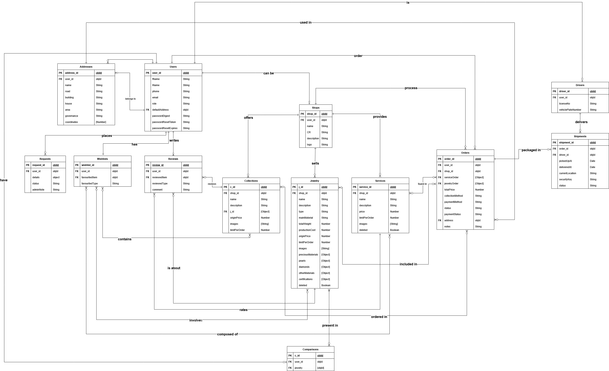

<h1>
  
  Durra
</h1>

**By:** [Kawthar Mohammad](https://github.com/Kawthara-M) | [Ghadeer Abdulla](https://github.com/igha07) | [Ragad Abdulla](https://github.com/RagadAbdulla)  
**Date:** 12 / 08 / 2025

## 📌 Description

**Durra** is the arabic pronunciation of pearl and things of value, and was chosen to intitle the web-based platform matching between jewelers and jewelry seekers in Bahrain. All guided by the vision of preserving Bahrain's jewelry heritage and culture.
Durra mainly provides an interface for jewelers and customers.

### Customer Features
- Search and Filter
- Wish List
- Add Jewelry, Collections, and Services to Cart
- Review Ordered Items
- Compare between Jewelry Pieces
- Precious Metals Live Prices

### Jeweler Features
- Offer Jewelry, Collections, and Services
- Receive Orders
- Accept/Reject Orders
- Update Order Status

### Admin Features
- Review Platform Statistics
- Account Management
- Requests Management

### Driver Features
- View Assigned Shipments
- Update Shipment Status

## 🚀 Planning & Diagrams

Durra has been developed with the end-user prioritized, so a first-time user is not to have a hard time figuring things out.
To ensure that, a careful analysis of the requirements was conducted. The obtained requirements were translated into several diagrams to guide the development.

### Entity Relationship Diagram (ERD)

  

## ⚙️ Technologies Used

- React.js (front-end)
- React.js libraries (e.g. Recharts, Chart.js)
- Node.js, Express Framework, MongoDB (back-end)
- Metals.Dev API (front-end live prices)

<!--## 🗺️ Prototype

The following figma prototypes present a visual blueprint of the platform's user interface and layout structure. Designed in a high-fidelity format, they served as an initial inspiration for development.

 include link -->

## Future Updates

- Reselling Feature
- Multi Language Support
- Online Order Tracking
- Mobile platform

| Even though Durra has not yet been deployed, a static website to provide more details about can be reached: [About Durra](https://durra.surge.sh/) |

## Attributations

<!-- - Locations Autocomplete (front-end): [Geoapify Autocomplete](https://www.geoapify.com/) -->

- Live metal rates: [metals.dev](https://metals.dev/dashboard)
- Search Logic (back-end): [Medium Platform](https://medium.com/@aniagudo.godson/running-a-simple-search-query-on-mongodb-atlas-using-express-nodejs-2-refining-search-queries-49949ce5c4a1)
- Password Validator (front-end): [geeksforgeeks](https://www.geeksforgeeks.org/reactjs/create-a-password-validator-using-reactjs/)
- Feedback Modal (front-end): [uiverse.io](https://uiverse.io/akshat-patel28/quick-baboon-29)
- Price Slider (front-end) : [Material UI](https://mui.com/material-ui/react-slider/)
- Icons (front-end): [flatIcon](https://www.flaticon.com/)
- Loading Animations (front-end): [CSS Loaders](https://css-loaders.com/dots/)
